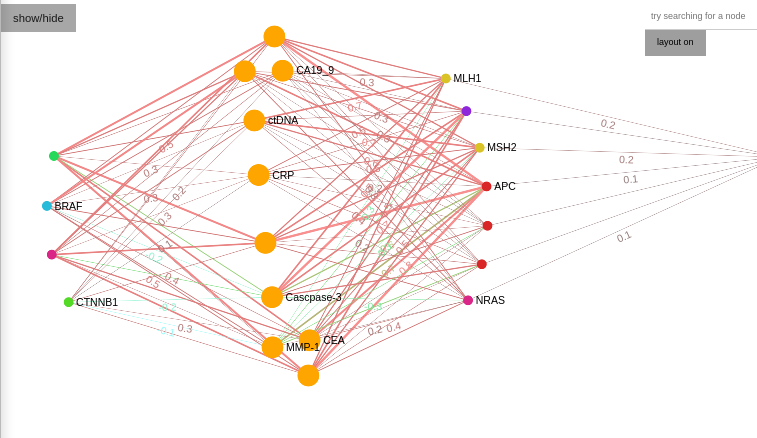

# Scientific Visuals - Introduction


This site includes reusable web components to visualise scientific data. You may use the components static pages listed bellow. Or you may host the web components in your application.

{: .note }
version: 0.1<br/>Note that the components are in heavy development stage thus some of the feature may not work or may change, while the static URL should remain


## Usage

The web components are deployed as static web pages. By default the visualise pregenerated demo data. 
In order to visualise them, use the form to use data on the web or upload your data from your computer.

The following component's static pages are available:
### geochart


<script> function generateURL() {
    const input = document.getElementById('userInput').value.trim();
    if(input) {
        const prefixURL = window.location.href+'geochart.html#';
        const fullURL = prefixURL + encodeURIComponent(input);
        const fullURLEurope = prefixURL + encodeURIComponent(input)+'&europe';
        document.getElementById('generatedURL').innerHTML = `<a href="${fullURL}" target="_blank">${fullURL}</a>`;
        document.getElementById('generatedEUURL').innerHTML = `<a href="${fullURL}" target="_blank">${fullURLEurope}</a>`;
    } else {
        document.getElementById('generatedURL').innerHTML = 'Please enter a value.';
    }
}
</script>

<script> function generateNetworkURL() {
    const input = document.getElementById('userNetworkInput').value.trim();
    if(input) {
        const prefixURL = window.location.href+'networkgraph.html#';
        const fullURL = prefixURL + encodeURIComponent(input);
        document.getElementById('generatedNetworkURL').innerHTML = `<a href="${fullURL}" target="_blank">${fullURL}</a>`;
        
    } else {
        document.getElementById('generatedNetworkURL').innerHTML = 'Please enter a value.';
    }
}
</script>
* Basic link: [geochart](geochart.html)
* give url of your data:<input type="text" id="userInput" placeholder="Enter your value" /> <button onclick="generateURL()">Generate URL</button> 
   * and use/share the following to visualise it in world map: <span id="generatedURL"></span>
   * and use/share the following to visualise it in Europe map: <span id="generatedEUURL"></span>

### network graph


* Basic link: [networkgraph](networkgraph.html)
* give url of your data:<input type="text" id="userNetworkInput" placeholder="Enter your value" /> <button onclick="generateNetworkURL()">Generate URL</button> 
   * and use/share the following link to visualise it in world map: <span id="generatedNetworkURL"></span>


## Hosting on your own premises 

Web components are framework agnostic and can be used in HTML, Markdown (with enabled HTML tags) and web applications in the following way.
1. download local copy of `sv-components.es.js` 
2. include the script module that defines behavior of the web component's custom element: 
```html
<script src="sv-components.es.js" type="module"></script>
```
3. use the web components custom element in the HTML body in Markdown e.g.:

```xml
Some HTML text <p>paragraph<p>
    And web component goes here:
<sv-geochart></sv-geochart>
```

Complete minimal example:
```html
<!DOCTYPE html>
<html lang="en">
<head>
  <meta charset="UTF-8">
  <meta name="viewport" content="width=device-width, initial-scale=1.0">
  <title>Scientific Visuals Web Components demo</title>
  <script src="sv-components.es.js" type="module"></script>
  <link rel="stylesheet" href="style.css" />
</head>
<body>  
  <sv-geochart></sv-geochart>
</body>
</html>
```


The following components are available

* `<sv-geochart></sv-geochart>` Visualising data in geochart
* `<sv-table></sv-table>` Data in an interactive table sheet
* `<sv-network></sv-network>` Data visualised in a connected network graph

