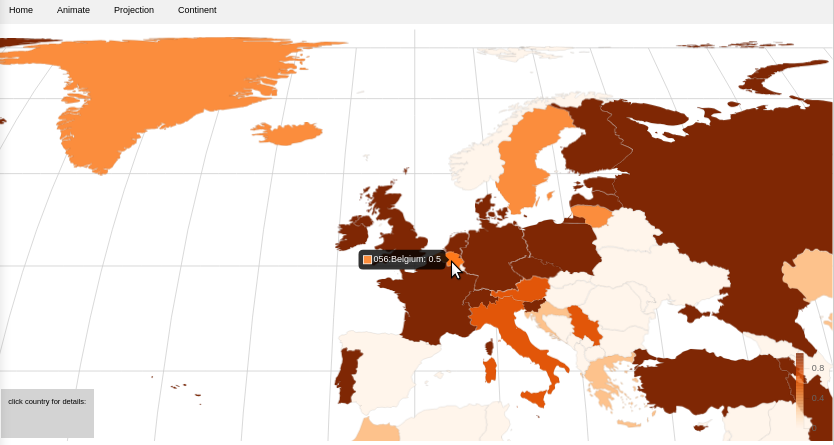

# sv-geochart

Visualising geo chart.

## Usage

* Basic link: [geochart](geochart.html)
* give url of your data:<input type="text" id="userInput" placeholder="Enter your value" /> <button onclick="generateURL()">Generate URL</button> 
   * and use/share the following to visualise it in world map: 
   * and use/share the following to visualise it in Europe map: 

## Hosting web component in HTML or web app

Syntax: `<sv-geochart datasrc='' countriessrc='' continent=''></sv-geochart>` 

Attributes:
* `datasrc` url of data to be visualised in the geochart. CSV data are expected, country per row. Default value `g/National_Initiatives_Figure_Data.csv`
* `countriessrc` url of map coordinates to be visualised, e.g. map of countries. Default value `g/countries-50m.json` 
* `continent` continent to be focused during view. Default value `world` 
